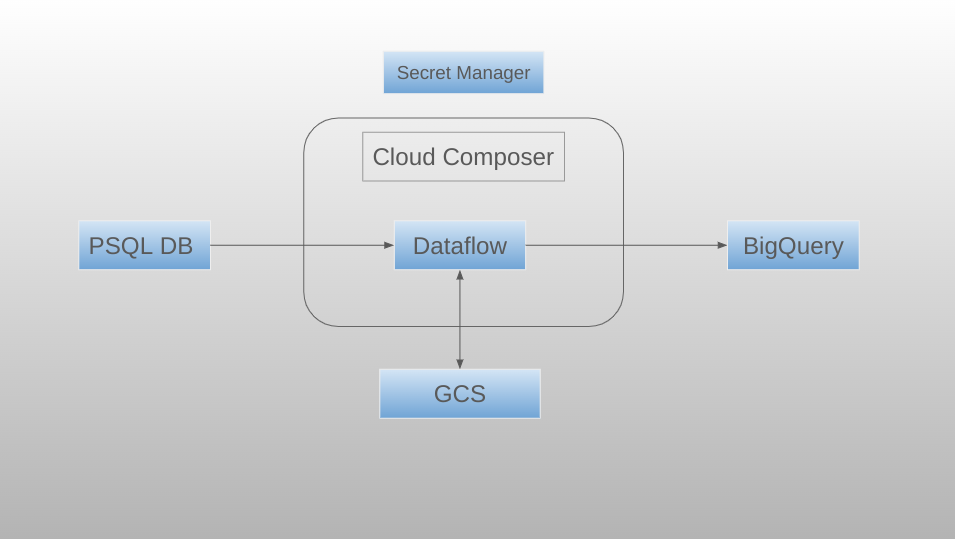

# project_nova


### Create Cloud Storage Bucket


Requirements :
- Google Cloud CLI [Guide](https://cloud.google.com/sdk/docs/install)
- GCP Project

1. We can use Cloud Shell or Local Environment with Cloud SDK installed. 
2. Setup Google Cloud configurations
```
gcloud init
```
2. Clone repo 
3. Authenticate with GCP using CLI
```
gcloud auth application-default login
```
4. Create Bucket in the Project 
```
project_id=$(gcloud config get-value project)
gsutil mb -l us-central1 gs://[BUCKET_NAME]
```
4. Update the [BUCKET_NAME] in backend.tf and terraform.tfvars.
5. Provide required details in terraform.tfvars
6. Execuite the Terraform Files

```
terraform init
terraform plan
terraform apply --auto-approve
```

6. Destroy the resources

```
terraform destroy --auto-approve
```





### Overview 

Load Data from on-prem system(Compute Instance) to BigQuery Through Dataflow. Used Airflow for Orchestration of pipeline.
